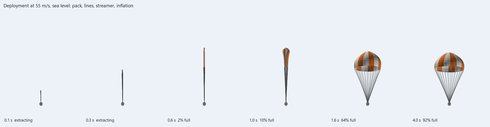
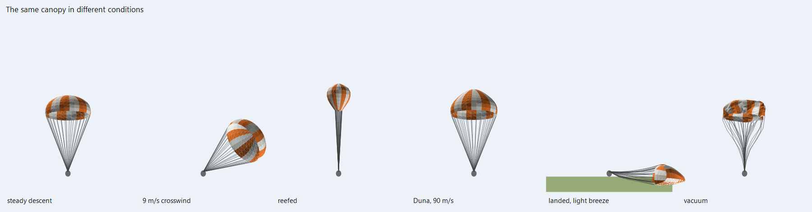
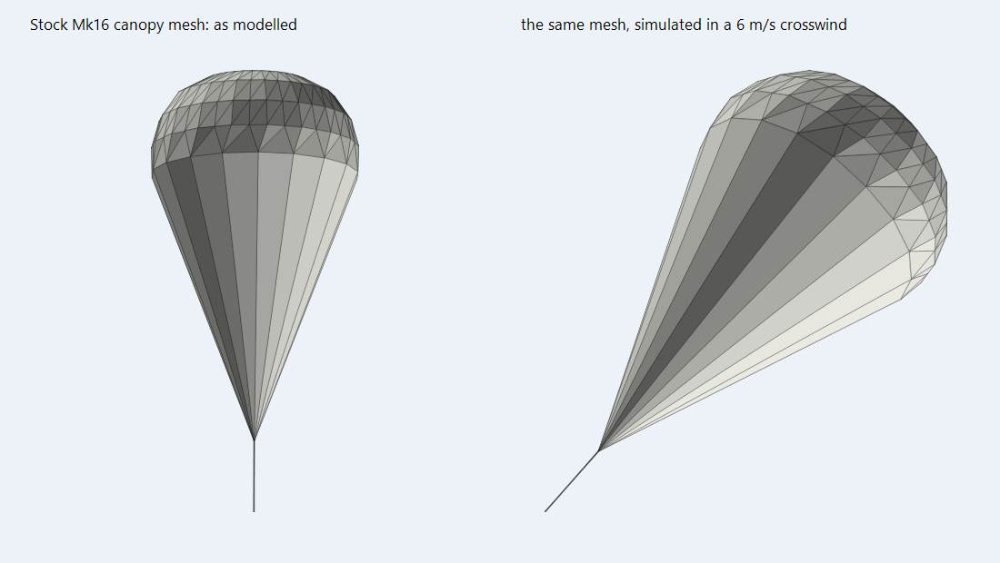

# ParaSoft Airbraking Technologies

**Parachutes made of fabric. Canopies that leave their pack, stream out, fill with air,
breathe, swing in the wind, collapse onto the ground and ride the waves - on every
parachute you already have.**

[](https://www.kerbalspaceprogram.com/)
[](https://github.com/CritZitGaming/KSP-ParaSoft/releases)
[](LICENSE)

<!-- CKAN-PENDING:START — delete this whole block once the NetKAN PR is merged -->
> ⏳ **Not on CKAN yet.** The listing is [submitted and awaiting review](https://github.com/KSP-CKAN/NetKAN/pull/11620).
> Until it's merged, grab it from [Releases](https://github.com/CritZitGaming/KSP-ParaSoft/releases) — see [Manual install](#manual).
<!-- CKAN-PENDING:END -->

<p align="center">
  
  <br><sub>Renders from the offline solver tests, not in-game screenshots.</sub>
</p>

A KSP parachute is a scale animation. The canopy grows out of the part in the same few
frames whether you open it at 50 m/s over Kerbin or 400 m/s over Duna, points perfectly
into the airflow, never flutters, never tangles, and when you land it hangs in the air or
vanishes.

ParaSoft replaces that with a softbody. Each canopy is simulated as cloth on its seams,
with suspension lines, a pilot chute and ram air filling it, and the part's own canopy
mesh - its texture, its colours, its encoded message - follows the simulation.

**It does not change drag.** Your parachute mod - stock, RealChute or FAR - keeps
computing and applying every newton of drag exactly as before. ParaSoft only simulates
and draws the canopy, and never pushes back on the craft. Descent rates, RealChute's
sizing, FAR's aerodynamics and every landing predictor stay exactly as they were.

---

## What it does

**Deploys like the real thing.** The pack leaves the part through its cap. Lines pay out
behind the pilot chute, then the hem, then the canopy ring by ring as a streamer. Air finds
the mouth, the crown fills first, and the canopy blossoms. Reefed chutes stay reefed - a
narrow, partly filled canopy - and disreef with a proper opening when the parachute module
says so. The canopy is never shown more open than the module's own drag says it is, so
what you see always matches what the craft feels.

**Reacts to where it is.** Nothing is special-cased per planet: the same canopy behaves
differently because the air is different.

<p align="center">
  
</p>

- **Thick air** (Kerbin, Laythe, Eve): fills fast, swings slowly - a canopy drags a lot of
  air along with it.
- **Thin air** (Duna): needs far more speed to fill, and sags and swings more once it has.
- **Supersonic**: loses drag area and *breathes* - the canopy pulses a few times a second
  as the shock ahead of it stands off and collapses, as every Mars parachute test shows.
- **Vacuum**: the pack still leaves the part, but nothing fills it. The canopy hangs limp
  in whatever shape its momentum leaves it.

**Trails the air it meets.** An open canopy pulls along the airflow it actually meets,
so it streams straight behind the craft, swings back when knocked aside, and settles
rather than gliding off to one side.

**Wind.** With [Kerbal Weather Project](https://github.com/cmac994/KerbalWeatherProject)
the canopy sees KWP's wind, and any other wind mod that registers with FAR works too. The
canopy never pushes the craft, so it has to agree with the parachute module's own drag.
It therefore gets exactly as much of the wind as the craft's own aerodynamics feel: all
of it under FAR, less in stock (where KWP applies only part of the wind's force to
parachutes), none with RealChute, whose drag ignores wind. A canopy never streams off
sideways from a craft that is falling straight down. Small gusts make canopies breathe and
flutter even in still air.

**Things it touches.** Canopies collapse onto the ground when you land and drape over
terrain, KSC buildings, Parallax's scatter rocks, your lander, kerbals and other vessels.
On water they spread out and float low - and with [Scatterer](https://github.com/LGhassen/Scatterer)'s
craft wave interactions on, they ride its waves, each part of the canopy on the wave under
it. Canopies are solid to one another - cluster-mates, the craft's other chutes, other
craft's - and a cluster spreads apart the way real ones do.

**Cut it and it flies away.** A cut canopy - or one whose part was destroyed - keeps
flying on its own until it is out of range, has settled on the ground or the sea, or half
a minute has passed.

**Uses your models.** The canopy you see is the part's own mesh, deformed. Stock, ReStock,
RealChute's canopy models and textures, [Custom Parachute Message](https://github.com/Icecovery/CustomParachuteMessage)'s
encoded canopies, TexturesUnlimited recolours, KSP's heat glow and part highlighting all
carry over. Cluster models (RealChute's triple, ReStock's Mk16-XL) are recognised as
separate canopies, and each canopy's lines, riser (shock cord) and any shared strap are
found where the model has them, so they hold their shape as the canopy moves.

<p align="center">
  
</p>

---

## What it doesn't do

- **Change drag, heat or anything else about the flight.** Cosmetic and reactive only, by
  design. Parachute modules keep all their own physics, deployment logic, heat damage,
  cutting and repacking.
- **Parafoils.** Canopies that are not round - including the stock kerbal EVA parachute -
  keep their parachute module's own animation. ParaSoft reads the canopy's shape from the
  model, and a rectangular wing is not something it can simulate yet.
- **Push things.** Canopies are pushed by what they touch; nothing is pushed by canopies.
- **Self-collision.** A canopy does not collide with itself, only with other canopies and
  everything else.

---

## Install

### CKAN (recommended)

<!-- CKAN-PENDING:START — delete this block once the NetKAN PR is merged; the line below is already correct -->
*Not available through CKAN yet — the [listing](https://github.com/KSP-CKAN/NetKAN/pull/11620) is awaiting review by the CKAN team. Use the
manual install below in the meantime. Once it lands, this is all you'll need:*
<!-- CKAN-PENDING:END -->

Search for **ParaSoft Airbraking Technologies** and install. CKAN pulls in Module Manager
for you.

### Manual

1. Install [Module Manager](https://github.com/sarbian/ModuleManager/releases) if you
   don't have it.
2. Download `ParaSoft-<version>.zip` from
   [Releases](https://github.com/CritZitGaming/KSP-ParaSoft/releases).
3. Copy the `ParaSoft` folder into your `GameData` folder.

Works with KSP 1.12.x. RealChute, FAR, Kerbal Weather Project, Scatterer, Custom Parachute
Message, ReStock and KerbalFX are all optional.

---

## Settings

In-game: **Settings → Difficulty options → ParaSoft**, per save.

| Setting | Default | What it does |
|---|---|---|
| Softbody parachutes | on | Master switch. Off puts every parachute back to its own animation. |
| Quality | 1 | 0 low, 1 medium, 2 high: how finely each canopy is simulated. |
| Canopies collide with craft | on | Fabric drapes over parts, kerbals and other vessels. |
| Canopies land on terrain and water | on | Collapse onto the ground, lie on the sea. |
| Ocean waves move canopies | on | Ride Scatterer's waves, when its craft wave interactions are on. |
| Wind moves canopies | on | KWP's wind, or any wind registered with FAR. |
| Turbulence | 1.00 | Small gusts that make canopies breathe and flutter. |
| Kerbal EVA parachutes | on | Simulate kerbals' parachutes too, where their shape allows. |
| Cut canopies linger (s) | 30 | Longest a cut canopy keeps flying. It goes sooner once it is 750 m from the camera and your craft, or has settled on the ground or sea. |

Every part with a softbody canopy also shows its state in its right-click menu:
*deploying*, *reefed, 40% full*, *92% inflated*, *collapsed*, *limp (no airflow)*.

`GameData/ParaSoft/Settings.cfg` holds the physical constants - fabric weight, porosity,
filling time, the mass of air a canopy drags along, stiffness, how firmly canopies trail
the airflow, ejection speed, level of detail distances, the canopy budget and how far away
cut canopies are removed - each documented in the file.

To keep one part's canopy animated the old way, patch its module:

```
@PART[myPart]:AFTER[ParaSoft] { @MODULE[ModuleParaSoft] { @simulate = false } }
```

---

## Performance

| Quality | Solver, per canopy per physics frame |
|---|---|
| Low | ~0.13 ms |
| Medium | ~0.3 ms |
| High | ~0.5 ms |

Measured offline on .NET; KSP's Mono runtime is somewhat slower. Moving the canopy mesh
costs about 0.1 ms per thousand vertices, only after the simulation has stepped and never
for canopies off-screen. Canopies more than 600 m from the camera step at half rate and
pause beyond 2.5 km. At most 24 canopies simulate at once (a cluster counts each canopy);
any more deploy with their own animation.

---

## Compatibility

| Mod | |
|---|---|
| **Stock** `ModuleParachute` | ✅ All stock and ReStock round parachutes. |
| **RealChute** | ✅ Every `RealChuteModule` parachute, including dual chutes (main and drogue each simulated), RealChute's canopy models and textures, and its material weights. |
| **FAR** | ✅ FAR's built-in RealChuteLite (`RealChuteFAR`). FAR's aerodynamics are untouched - ParaSoft never applies a force. |
| **Custom Parachute Message** | ✅ Its encoded canopy is fitted like any other and keeps its shader - the message deforms with the fabric. |
| **Kerbal Weather Project** | ✅ Canopies use KWP's wind, as much of it as the craft itself is feeling. |
| **Scatterer** | ✅ Canopies float on the sea, and ride its waves when its craft wave interactions are on. |
| **ReStock** | ✅ Its skinned canopies, including the Mk16-XL's three-canopy cluster and its shared riser. |
| **Other mods' parachutes** | ✅ Any round canopy on stock `ModuleParachute` or RealChute (Tantares, Bluedog, Boring Crew Services' Starliner and others) is fitted the same way, risers and clusters included. |
| **KerbalFX** | ✅ A small patch keeps AeroFX's ribbons off parachute parts, whose original (hidden) canopy mesh would otherwise anchor them. |
| **Parallax** | ✅ Canopies land on collideable scatter. |
| **PlanetShine, Deferred, TUFX, TexturesUnlimited** | ✅ Canopies are drawn with the parts' own materials. |
| **Trajectories, MechJeb, KER** | ✅ Nothing they read is changed. |
| **Stock EVA parachutes** | ➖ A parafoil: keeps its own animation. |

---

## How it works

In short: when a part loads, ParaSoft plays its parachute's deploy animations to the last
frame, bakes the open canopy mesh, finds the round canopies in it, and builds a particle
lattice on their seams and lines. When the module deploys, that lattice is simulated as
cloth - position-based dynamics with ram-air pressure, apparent mass, a pilot chute and a
deployment bag - and the part's own mesh is moved to follow it. The full story, with the
numbers and the reasoning, is in [docs/TECHNICAL.md](docs/TECHNICAL.md).

---

## Building

Needs only the .NET Framework's own C# compiler and a KSP install to reference:

```
.\Tools\Build.ps1                 # ParaSoft/Plugins/ParaSoft.dll
.\Tools\Build.ps1 -Install        # ...and copy ParaSoft into GameData
.\Tools\Test.ps1                  # solver checks, plus every parachute model in your install
```

The solver in `Source/ParaSoft/Core` has no Unity dependency, so the tests run it as a
plain console program.

---

## Licence

MIT - see [LICENSE](LICENSE). Made by CritZitGaming.
